# JavaGameOOP

## RED HOOD - 2D Dark Fantasy RPG


A fully object-oriented Java game that showcases the power of OOP principles in game design. Built with a focus on clean architecture, modular structure, and maintainable code, this project combines solid programming fundamentals with fun and challenging gameplay in a dark-fantasy setting.

### 📖 Story

Red Hood, a brave and skilled wizard, discovers an ancient manuscript that reveals the existence of a legendary magic potion - a brew capable of granting mastery over any spell. However, Valthros, an evil wizard with plans for world domination, is seeking the same ingredients.

The ingredients are hidden in a cursed cemetery, guarded by the spirits of those who tried and failed to create the potion. Red Hood must face waves of enemies, deadly traps, and the darkness itself to stop Valthros and save the world.


### ✨ Features

**Gameplay**
* **5 Progressive Levels** - Each level introduces new mechanics and increases in difficulty
* **Dual Combat System** - Melee and ranged attacks with stamina management
* **Ingredient Collection** - Find magic potions to progress and win
* **NPC Interaction** - Friendly wizards offer tips and stories
* **Fog of War System** - Limited visibility in dark levels
* **Save/Load System** - Save progress and continue later

**Enemies and Challenge**
* **4 Unique Enemy Types** - Each with its own mechanics and distinct AI
* **Epic Boss Fight** - Final confrontation with Valthros, the evil wizard
* **Progressive Design** - Every mechanic learned is essential to finish the game
* **Strategic Positioning** - Enemies are placed to create tactical challenges

**Audio and Atmosphere**
* **Original Soundtrack** - 3 musical tracks for menu and levels
* **Sound Effects** - 9 sound effects for actions and interactions
* **Full Audio Control** - Adjust music and effects volume independently

**OOP Architecture**
* **Modular Structure** - Clean, organized, and easy-to-maintain code
* **OOP Principles** - Encapsulation, inheritance, polymorphism, and abstraction
* **Design Patterns** - Factory Method, Abstract Factory, State Pattern
* **SQL Database** - Data persistence and player progress

---

### 🎮 Controls

| Action | Key |
| :--- | :---: |
| Move Left/Right | `A` / `D` |
| Jump | `W` / `SPACE` |
| Melee Attack | `Left Click` |
| Ranged Attack | `Q` |
| Interact with NPC | `E` |
| Pause | `ESC` |

### 🖼️ Screenshots

**Main Menu**

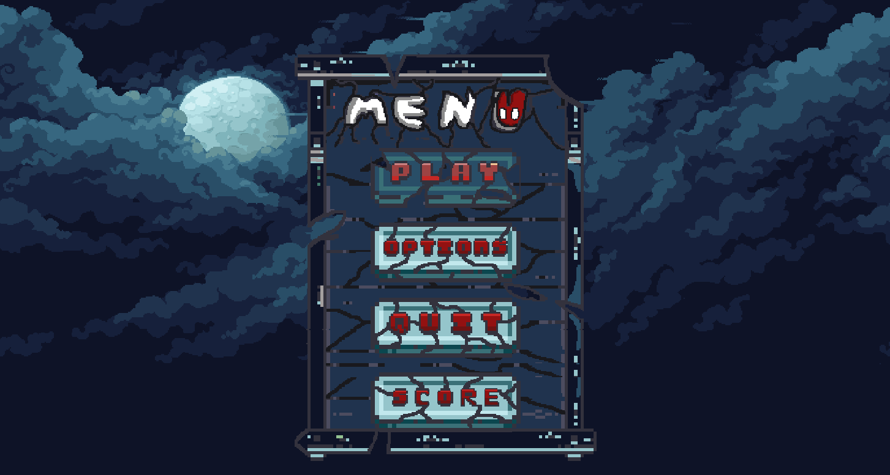


*Intuitive interface with options for Play, Settings, Scores, and Quit*


### 🎮 Gameplay Core

**Dynamic Camera**
<br>
Smoothly follows the character across the entire map, offering a cinematic experience.
<br><br>
<p align="center">
  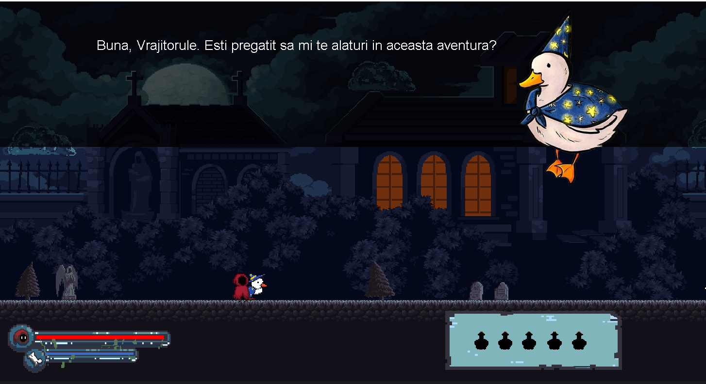
</p>

<br>

**Advanced Platforming & Destructible Objects**
<br>
Explore on ground, bridges, clouds, and many other surfaces. Discover potions by breaking strategically placed crates and barrels.
<br><br>
<p align="center">
  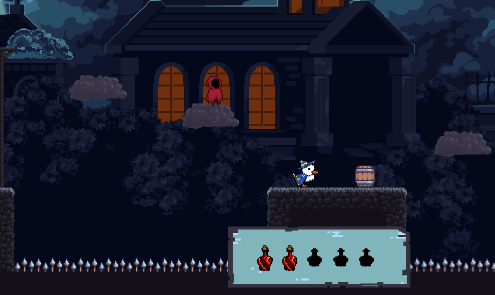
</p>

<br>

**Fog of War**
<br>
Dark levels limit player visibility, creating tension and requiring careful exploration.
<br><br>
<p align="center">
  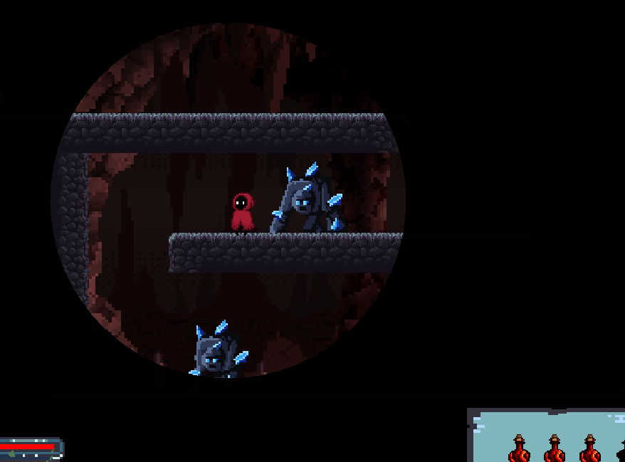
</p>

<br>

**Trap System**
<br>
Avoid lethal spikes, automated cannons, and toxic tar zones that require quick reflexes and planning.

<table width="100%">
  <tr>
    <td width="50%" align="center">
      
      <br><i>Lethal Spikes</i>
    </td>
    <td width="50%" align="center">
      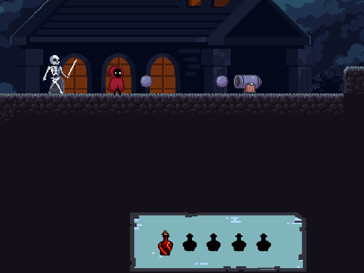
      <br><i>Automated Cannons</i>
    </td>
  </tr>
</table>

---

### ⚔️ Enemy Types

<table width="100%">
  <tr>
    <td width="50%">
      <b>Sword Skeletons</b><br>
      The first enemies encountered, guarding the cemetery entrance. They offer a gentle introduction to the game's combat system.
    </td>
    <td width="50%" align="center">
      
    </td>
  </tr>
  <tr>
    <td width="50%">
      <b>Mace Skeletons</b><br>
      Stronger and more aggressive variants that can occasionally spawn poison potions. Defeating them requires more advanced tactics.
    </td>
    <td width="50%" align="center">
      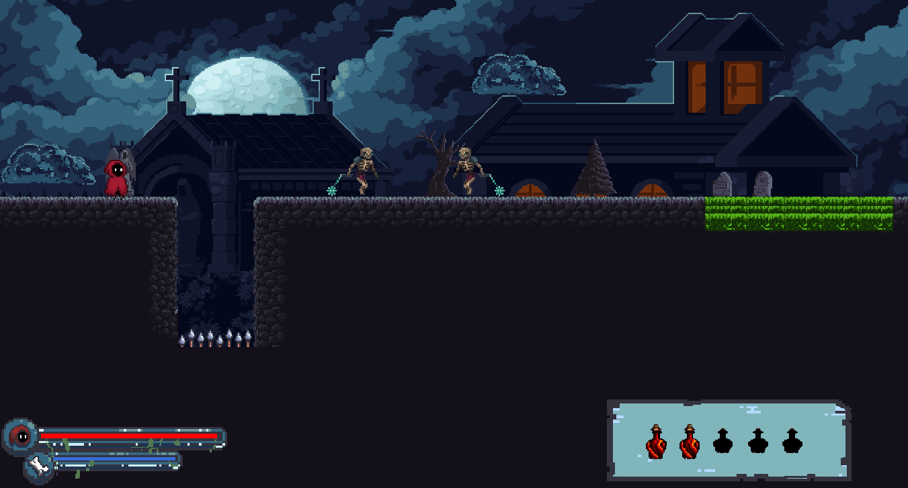
    </td>
  </tr>
  <tr>
    <td width="50%">
      <b>Golems</b><br>
      Massive crypt guardians that increase in speed and aggression when wounded. A major danger requiring careful resource management.
    </td>
    <td width="50%" align="center">
      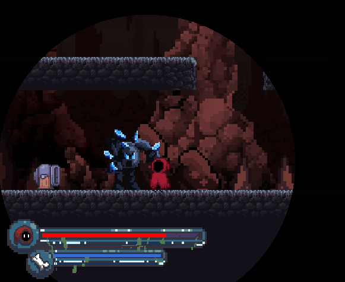
    </td>
  </tr>
</table>

---

### 💀 Boss Fight

**Valthros (Final Boss)**
<br>
The evil wizard with devastating attacks, both melee and ranged. Permanent health bar on screen. The final confrontation requires all skills learned throughout the game.

<table width="100%">
  <tr>
    <td width="50%" align="center">
      
      <br><i>The Final Confrontation</i>
    </td>
    <td width="50%" align="center">
      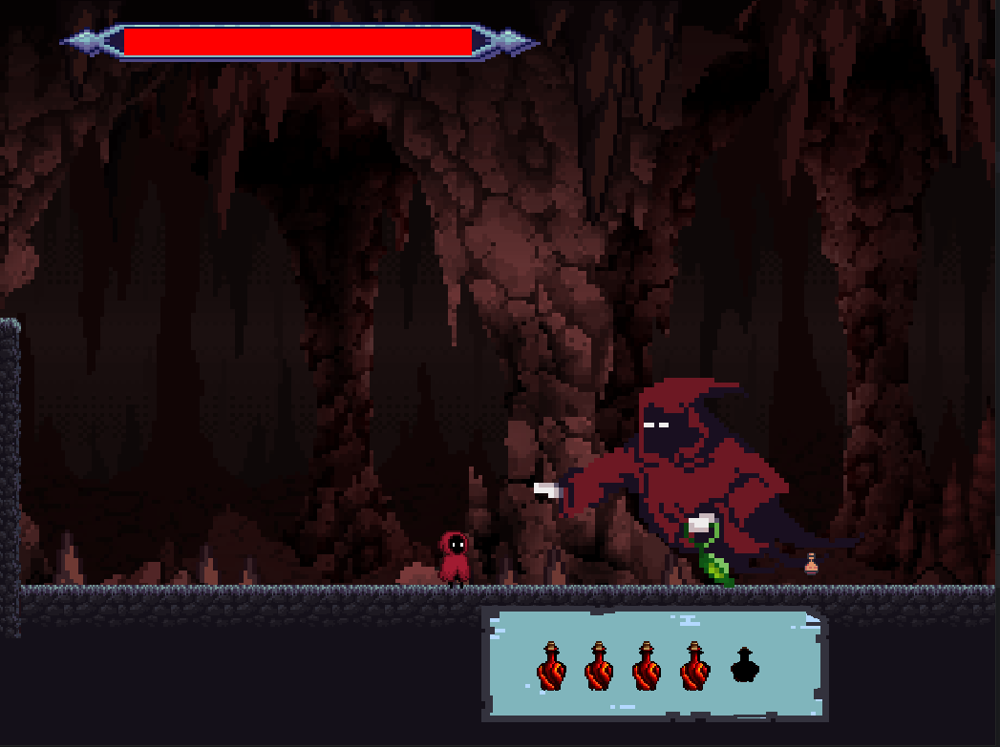
      <br><i>Devastating Dash Attack</i>
    </td>
  </tr>
</table>

---

### ⚙️ Interfaces and Systems

**Menus and Settings**
<table width="100%">
  <tr>
    <td width="50%" align="center">
      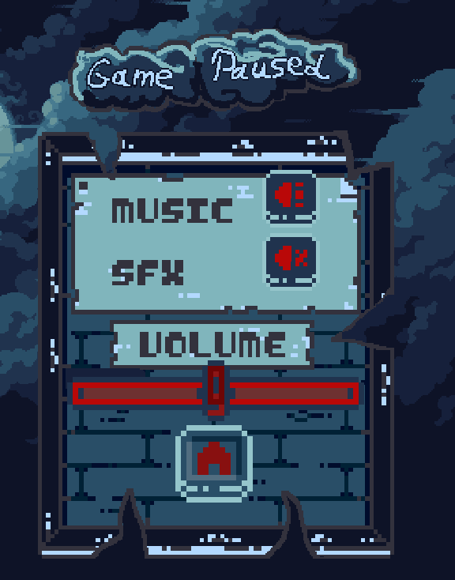
      <br><i>Settings Menu</i>
    </td>
    <td width="50%" align="center">
      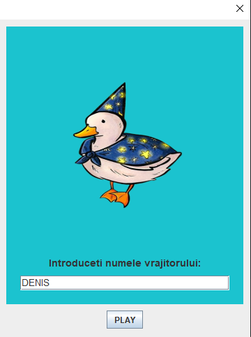
      <br><i>Start Game Screen</i>
    </td>
  </tr>
</table>

**Game States**
<table width="100%">
  <tr>
    <td width="50%" align="center">
      
      <br><i>Victory Screen</i>
    </td>
    <td width="50%" align="center">
      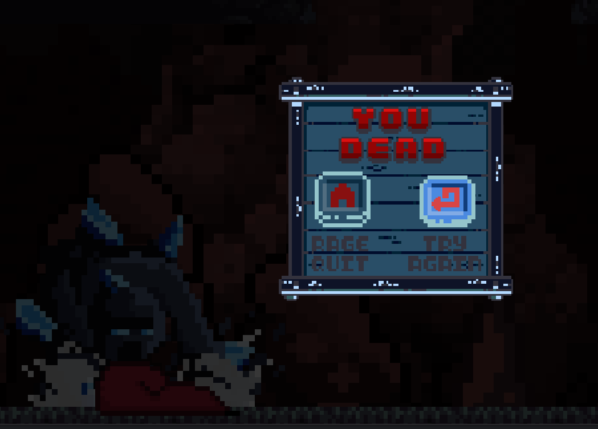
      <br><i>Game Over Screen</i>
    </td>
  </tr>
</table>


### 🎯 Levels

**Level 0 - Tutorial**
* **Goal:** Learn basic controls
* **Enemies:** None
* **NPCs:** Instructor Wizards
* **Focus:** Familiarization with game mechanics

**Level 1 - Cemetery Entrance**
* **Enemies:** Sword Skeletons
* **Hazards:** Lethal Spikes
* **Objects:** Crates, barrels, potions
* **New Mechanic:** Basic combat and collection

**Level 2 - Deep Cemetery**
* **Enemies:** Mace Skeletons (stronger variants)
* **Hazards:** Green Tar (continuous damage), automated cannons
* **New Mechanic:** Jump boost potion, projectile avoidance

**Level 3 - The Dark Crypt**
* **Enemies:** Golems (tanks, adaptive behavior)
* **Hazards:** Fog of War (extremely limited visibility)
* **New Mechanic:** Exploration in total darkness

**Level 4 - The Final Confrontation**
* **Boss:** Valthros
* **Attacks:** Devastating Dash + Magic Projectiles (orbs)
* **New Mechanic:** Boss fight with complex attack patterns
* **Special:** Permanent boss health bar

**Victory Conditions:** Kill all enemies, collect all ingredients, and reach the end of the map.

### 🏗️ Technical Architecture

**Implemented Design Patterns**

**Factory Method Pattern**
Used for creating different types of enemies (**Skeletons**, **Golems**, **Boss**). Each enemy type is generated through a dedicated factory that manages their initialization and configuration, ensuring modular and extensible code.

**Abstract Factory Pattern**
Implemented for creating interactive game objects (containers and traps). This pattern allows for the coherent generation of related objects such as **barrels**, **crates**, **spikes**, and **tar zones**, maintaining design consistency.

**State Pattern**
Manages different game states with fluid transitions:
* **MENU** - Main menu with options
* **PLAYING** - The active game loop
* **OPTIONS** - Audio settings screen
* **SCORES** - Player leaderboard
* **QUIT** - Exiting the game

Each state has its own update and render logic, allowing for a clear separation of responsibilities.

**Observer Pattern (Implicit)**
The event system coordinates interactions between components for collisions, item collection, enemy elimination, and damage management.


## 🏛️ Project Structure

```text
src/
├── audio/              # Audio system (music, sound effects)
│   └── AudioPlayer.java
├── entities/           # Game entities
│   ├── Factory/        # Factory patterns for entities
│   ├── Player.java     # Main character
│   ├── Enemy.java      # Abstract class for enemies
│   ├── Boss.java       # Final Boss - Valthros
│   ├── Skelly.java     # Skeleton enemies
│   ├── Golem.java      # Golem enemies
│   ├── Npc.java        # Non-combat characters
│   └── EnemyManager.java
├── gamestates/         # State pattern implementation
│   ├── Gamestate.java
│   ├── Menu.java
│   ├── Playing.java
│   ├── GameOptions.java
│   └── Scores.java
├── levels/             # Level system
│   ├── Level.java
│   └── LevelManager.java
├── Objects/            # Interactive objects
│   ├── Factory/        # Abstract Factory for objects
│   ├── GameObject.java
│   ├── Potion.java
│   ├── Projectile.java
│   ├── Cannon.java
│   └── ObjectManager.java
├── ui/                 # User Interface
│   ├── MenuButton.java
│   ├── PauseOverlay.java
│   ├── GameOverOverlay.java
│   ├── AudioOptions.java
│   └── VolumeButton.java
├── utilz/              # Utilities
│   ├── Constants.java
│   ├── HelpMethods.java
│   └── LoadSave.java
├── inputs/             # Input management
│   ├── KeyboardInputs.java
│   └── MouseInputs.java
└── main/               # Entry point
    ├── Game.java
    ├── GamePanel.java
    ├── GameWindow.java
    ├── MainClass.java
    └── ScoreDatabase.java

```


### 💾 Database - SQLite

The game uses **SQLite** for data persistence, saving player progress, scores, and detailed statistics.

**Functionalities**
* **Auto Save** - Progress is saved upon level completion and in the pause menu.
* **Load Game** - Continue from where you left off with the same player.
* **Global Leaderboard** - Top players based on cumulative scores.
* **Detailed Statistics** - Tracks defeated enemies, collected potions, and level progress.

**Save/Load System**
The system saves the exact player position, health status, defeated enemies, and collected items, allowing for precise progress resumption. Data is stored in two main tables: `final_scores` for individual scores and `cumulative_scores` for the player's total progress.


### 🔧 Technical Details

**Specifications**
* **Language:** Java 17+
* **UI Framework:** Java Swing for the graphical interface
* **Audio Engine:** `javax.sound.sampled` for music and sound effects
* **Database:** SQLite JDBC for data persistence
* **Resolution:** 1456x784 pixels (26x14 tiles)
* **Performance:** 120 FPS for rendering, 200 UPS for game logic

**Physics System**
The game implements a custom physics engine for gravity, jumping, and collisions. The collision system is based on tiles and precise hitboxes for entities, ensuring realistic interactions between the character, enemies, and the environment. It includes support for moving platforms, sliding surfaces, and zones with modified physics.

**Combat System**
The player has two types of attacks - melee for rapid and consistent damage, and ranged for dangerous situations or distant enemies. Ranged attacks consume stamina which regenerates automatically over time. Each enemy type has its own unique attack patterns, timing, and behavior.

**Artificial Intelligence**
Enemies use a state-based AI system (patrolling, player detection, chasing, attacking) with detection based on line-of-sight. The system checks if the player is within visibility range and if there are obstacles between the enemy and the target. The AI adapts according to the level context and enemy state.


### 👥 Development Team

Project developed by students from the Faculty of Automatic Control and Computer Engineering, as part of the Advanced Object-Oriented Programming (PAOO) course.

| Name | Main Contributions |
| :--- | :--- |
| **Todiraș Claudiu Gabriel** | Game Loop, State Management, Audio System, NPC System, Documentation |
| **Dumitriu Denis Gabriel** | Player Input System, UI/Menus, Database (Save/Load), Objects & Traps |
| **Ghiorghiu Teodor** | Player Entity, Enemy System (Skelly, Golem), Final Boss, Level Design |


### 📚 Used Resources

**Video Tutorials**
* [Kaarin Gaming - Java 2D Game Development Tutorial](#)
* [RyiSnow - How to Make a 2D Game in Java](#)

**Graphic Assets**
* [AstroBob - Animated Pixel Art Skeleton](#)
* [MonoPixelArt - Skeletons Pack](#)
* [Lionheart963 - Wizard Character Sprites](#)
* [PixelFrog - Various Asset Packs](#)
* [itch.io - Free Tileset Collection](#)

**Audio**
* [Leo Paz - MiniFantasy Dungeon SFX Pack](#)

> **Note:** Some sprites and tiles were custom created by the team using **Piskel** to fit the game's theme.
